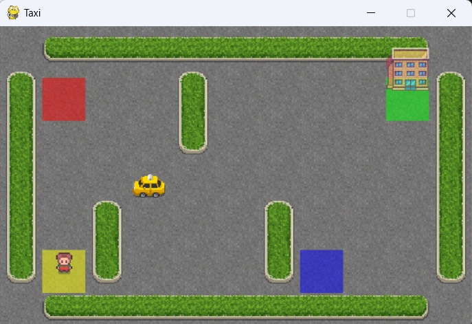

# taxi-quest-RL
## Reinforcement Learning with Q-learning on Taxi-v3

  

## About
This project demonstrates the application of Q-learning, a model-free reinforcement learning algorithm, to solve the **Taxi-v3** environment from OpenAI Gym. In this project, an agent (a taxi) learns to navigate a 5x5 grid to pick up and drop off passengers at specified locations using the Q-learning algorithm. The goal is to maximize the cumulative reward by making optimal decisions over time.

The learning process involves exploring the environment and updating the Q-table (a matrix that stores Q-values for state-action pairs) based on the feedback received from the environment. The agent starts with random actions and progressively learns better strategies through exploration and exploitation.

## Requirements
- Python 3.11
- gym==0.26.0
- numpy==1.23.5

---
An attempt to learn the the basics of RL using Q-learning. 
Feel free to fork or clone this repository for your own learning or experimentation :)
